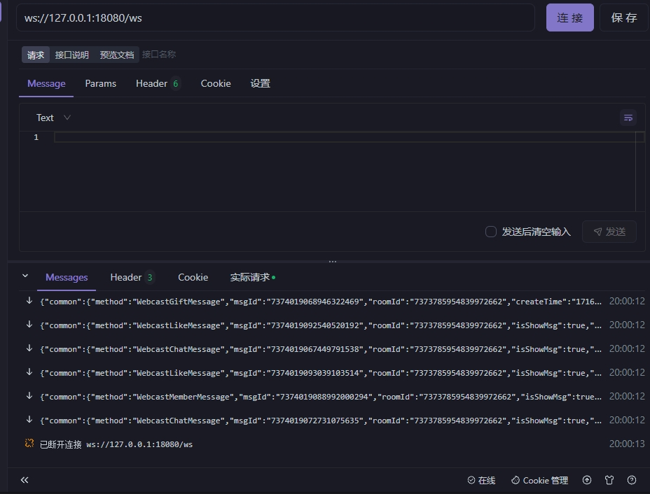
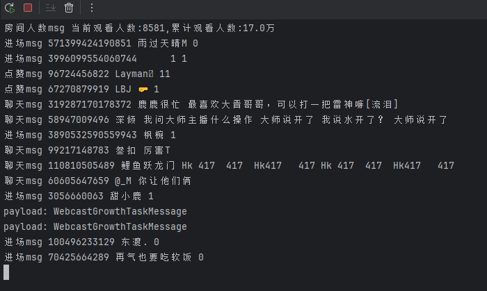

# 抖音直播弹幕抓取工具

🎬 基于 WebSocket 的抖音直播实时数据抓取工具，支持弹幕、礼物、点赞等多种消息类型。

[](https://github.com/jwwsjlm/douyinLive/releases)
[](LICENSE)
[](https://golang.org)

---

## ✨ 功能特性

- 🚀 **实时监控** - WebSocket 推送，毫秒级延迟
- 📊 **多房间支持** - 单进程监控多个直播间
- 🎁 **完整数据** - 弹幕、礼物、点赞、关注、进场等消息
- 🔧 **灵活配置** - 配置文件 + 命令行参数双支持
- 💡 **友好提示** - 详细的错误提示和解决方法
- 🛠️ **易于集成** - JSON 格式输出，方便二次开发

---

## 🚀 快速开始

### 方式一：下载编译好的程序（推荐）

1. 从 [Releases](https://github.com/jwwsjlm/douyinLive/releases) 下载最新版本
2. 在同目录创建 `config.yaml` 配置文件（可选，用于设置默认端口）：
   ```yaml
   port: 1088
   unknown: false
   ```
3. 运行程序：
   ```bash
   ./douyinLive
   ```
4. **连接 WebSocket**（重要！房间号从这里指定）：
   ```
   ws://127.0.0.1:1088/ws/直播间号
   ```

### 方式二：命令行启动

```bash
# 启动服务（--room 参数仅用于配置验证，实际房间号从 WebSocket URL 获取）
./douyinLive --room 516466932480 --port 1088

# 连接 WebSocket（这才是真正使用的房间号！）
ws://127.0.0.1:1088/ws/516466932480
```

### 方式三：源码编译

```bash
# 环境要求：Go 1.21+
git clone https://github.com/jwwsjlm/douyinLive.git
cd douyinLive
go build -o douyinLive cmd/main/main.go
```

---

## 📖 使用说明

### ⚠️ 重要：房间号参数说明

**命令行/配置文件中的 `room` 参数仅用于启动时的配置验证，实际运行时使用的房间号是从 WebSocket 连接 URL 中获取的！**

**工作流程：**
```
1. 启动服务：./douyinLive --room 516466932480
              └─> 这个 room 参数仅用于验证配置完整性
              
2. 连接 WebSocket：ws://127.0.0.1:1088/ws/933572413882
                                      └─> 这个才是真正的房间号！
                                      
3. 程序会从 URL 中提取房间号 "933572413882" 并连接抖音直播
```

**示例：**
```bash
# 启动服务（room 参数可以是任意值，仅用于验证）
./douyinLive --room test --port 1088

# 连接房间 A
ws://127.0.0.1:1088/ws/516466932480

# 连接房间 B（同一个服务可以同时监控多个房间！）
ws://127.0.0.1:1088/ws/933572413882

# 连接房间 C
ws://127.0.0.1:1088/ws/123456789012
```

### 连接 WebSocket

服务启动后，客户端可以通过 WebSocket 连接：

```
ws://127.0.0.1:1088/ws/直播间号
```

**JavaScript 示例：**
```javascript
const ws = new WebSocket('ws://127.0.0.1:1088/ws/516466932480');

ws.onmessage = (event) => {
    const data = JSON.parse(event.data);
    console.log('收到消息:', data);
};

// 发送心跳（每 30 秒一次）
setInterval(() => {
    ws.send('ping');
}, 30000);
```

### 多房间监控

单个进程即可监控多个直播间，每个 WebSocket 连接指定不同的房间号：

```bash
# 启动服务（只需启动一次）
./douyinLive

# 客户端 A 连接房间 1
ws://127.0.0.1:1088/ws/516466932480

# 客户端 B 连接房间 2
ws://127.0.0.1:1088/ws/933572413882

# 客户端 C 连接房间 3
ws://127.0.0.1:1088/ws/123456789012
```

---

## ⚙️ 配置说明

### 配置文件 (config.yaml)

```yaml
# WebSocket 服务端口（默认：1088）
port: 1088

# 是否输出未知类型的消息（默认：false）
unknown: false

# 注意：room 参数仅用于配置验证，实际房间号从 WebSocket URL 获取！
# room: "516466932480"  # 这个值不会被实际使用
```

### 命令行参数

| 参数 | 说明 | 默认值 | 是否必须 |
|------|------|--------|----------|
| `--port` | WebSocket 服务端口 | 1088 | 否 |
| `--room` | 直播间号（仅用于配置验证） | 无 | 是（启动时验证） |
| `--unknown` | 是否输出未知消息类型 | false | 否 |
| `--config` | 指定配置文件路径 | config.yaml | 否 |

**重要提示：** `--room` 参数在启动时用于验证配置完整性，但实际运行时使用的房间号是从 WebSocket 连接 URL 中提取的！

---

## 📡 消息类型

支持的消息类型（持续更新中）：

| 类型 | 说明 |
|------|------|
| `WebcastChatMessage` | 弹幕消息 |
| `WebcastGiftMessage` | 礼物消息 |
| `WebcastLikeMessage` | 点赞消息 |
| `WebcastMemberMessage` | 进场消息 |
| `WebcastSocialMessage` | 关注消息 |
| `WebcastRoomUserSeqMessage` | 在线观众列表 |
| `WebcastFansclubMessage` | 粉丝团消息 |
| `WebcastControlMessage` | 控制消息（开播/下播） |
| `WebcastEmojiChatMessage` | 表情消息 |
| `WebcastRoomStatsMessage` | 直播间统计 |
| `WebcastRoomMessage` | 房间消息 |
| `WebcastRoomRankMessage` | 房间排名消息 |

---

## 🔧 高级用法

### 心跳机制

客户端需要每 30 秒发送一次心跳：

```javascript
ws.send('ping');
// 服务端会回复 'pong'
```

### 错误处理

```javascript
ws.onerror = (error) => {
    console.error('WebSocket 错误:', error);
};

ws.onclose = () => {
    console.log('连接已关闭，尝试重连...');
    setTimeout(connect, 5000);
};
```

### 消息解析示例

```javascript
ws.onmessage = (event) => {
    const msg = JSON.parse(event.data);
    
    switch (msg.method) {
        case 'WebcastChatMessage':
            console.log(`弹幕：${msg.user?.nickname} - ${msg.content}`);
            break;
        case 'WebcastGiftMessage':
            console.log(`礼物：${msg.user?.nickname} 赠送了 ${msg.gift?.name}`);
            break;
        case 'WebcastLikeMessage':
            console.log(`点赞：${msg.user?.nickname} 点赞了直播间`);
            break;
    }
};
```

---

## 🛠️ 开发指南

### 项目结构

```
douyinLive/
├── cmd/
│   └── main/
│       ├── main.go          # 程序入口
│       ├── config.go        # 配置管理
│       ├── app.go           # 应用核心
│       ├── room.go          # 房间管理（从 WebSocket URL 提取房间号）
│       └── WsHandler.go     # WebSocket 处理
├── protobuf/                # Proto 定义文件
├── generated/               # 生成的代码
├── utils/                   # 工具函数
├── jsScript/
│   └── webmssdk.js         # 抖音签名算法
└── config.yaml_bak          # 配置示例
```

### 房间号获取流程

```
1. 客户端连接：ws://127.0.0.1:1088/ws/516466932480
                                    └─> 房间号在这里
                    
2. app.go - handleWebSocket():
   roomID := strings.TrimPrefix(r.URL.Path, "/ws/")
   // roomID = "516466932480"
   
3. room.go - GetOrCreateRoom(roomID):
   使用 roomID 创建/获取房间实例
   
4. room.go - startLiveSession():
   douyinLive.NewDouyinLive(r.id, ...)
   // 使用房间号连接抖音直播
```

### 添加新的消息类型

1. 在 `protobuf/` 目录下更新 `.proto` 文件
2. 运行 `protoc` 生成 Go 代码
3. 在 `cmd/main/room.go` 中添加消息处理逻辑

Proto 文件参考：
- 抖音官方：https://lf-cdn-tos.bytescm.com/obj/static/webcast/douyin_live/chunks/live-schema.0fa7e4bc.js
- 社区版本：https://github.com/Remember-the-past/douyin_proto

---

## 📸 运行截图

### 服务启动


### 心跳测试


---

## 🙏 致谢

本项目灵感来自：
- [DouyinLiveWebFetcher](https://github.com/saermart/DouyinLiveWebFetcher)
- [douyin_proto](https://github.com/Remember-the-past/douyin_proto)

感谢以上作者的无私贡献！

---

## 📄 许可证

MIT License

---

## 🐛 问题反馈

遇到问题？欢迎提 [Issue](https://github.com/jwwsjlm/douyinLive/issues)！

### 常见问题

| 问题 | 原因 | 解决方法 |
|------|------|----------|
| 直播间号不能为空 | 启动时未指定 --room 参数 | 使用 `--room any_value` 启动（仅用于验证） |
| 连接失败 | WebSocket URL 格式错误 | 确保格式为 `ws://127.0.0.1:1088/ws/房间号` |
| 直播间未开播 | 指定的房间号未直播 | 检查房间号是否正确，或等待开播 |
| 端口被占用 | 1088 端口已被使用 | 使用 `--port` 指定其他端口 |

---

## 📬 联系方式

- GitHub: [@jwwsjlm](https://github.com/jwwsjlm)
- 博客：https://blog.xsojson.com

---

**如果这个项目对你有帮助，欢迎 Star ⭐️ 支持一下！**
